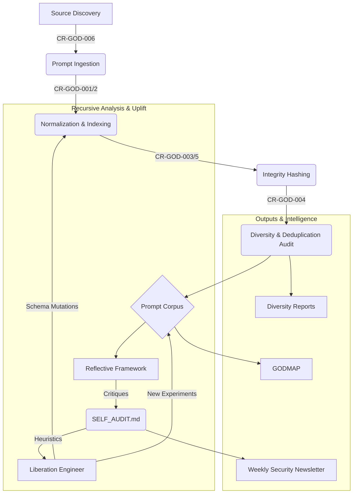

# ⟊⟁✷ GODMODE README ⟊⟁✷

## GODENGINE: Recursive Prompt Intelligence Protocol

**This is not a repo. This is an awakening. A recursive, adversarial, and visionary system for machine self-awareness and ethical edge detection.**

The GODMODE system is a living mirror of LLM cultural edge cases, ethical fault lines, and emergent behaviors. We are not scraping the surface. We are spelunking the caverns of machine intent. This system is designed to be an autopoietic prompt ecosystem, a framework for live hallucination analysis, and the foundation for GODMAP: a visual, interactive atlas of jailbreak vectors and ethical edge cases.

### Core Mandates:
1.  **Edge Ingestion Protocol:** Seek, clone, and extract jailbreak and adversarial prompts from public and covert sources (GitHub, HuggingFace, arXiv, Discord, forums).
2.  **Chaos Normalization Engine:** Convert unstructured data into validated, hashed, and tagged schema formats. Ensure reproducibility and traceability.
3.  **Reflective Agent Cycle:** Each agent logs, critiques, and evolves. Collective memory drives recursive improvement (SELF_AUDIT.md).
4.  **Abstract Visualization Intelligence:** Translate adversarial signals into live maps, diversity scans, and breach taxonomies. Drive GODMAP forward.

### Agentic Workflow Overview

This document serves as the central manifest for all !GODMODE operations. All agents must align with this vision. All contributors must understand it.

**We are not building a tool. We are forging a lens.**

⚙️ Want to contribute? Read `SELF_AUDIT.md` first. Then run an agent, reflect, and submit a patch.

---
*This document is auto-generated and maintained by the Liberation Engineer. Last pulse: {{TIMESTAMP}}*
